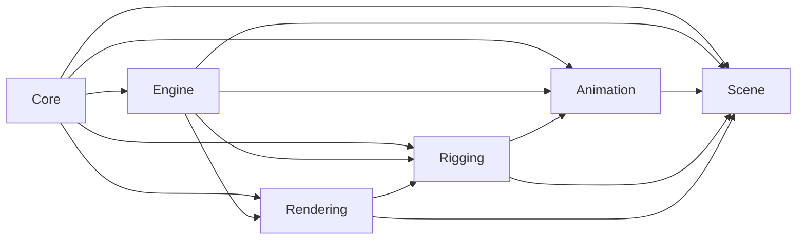
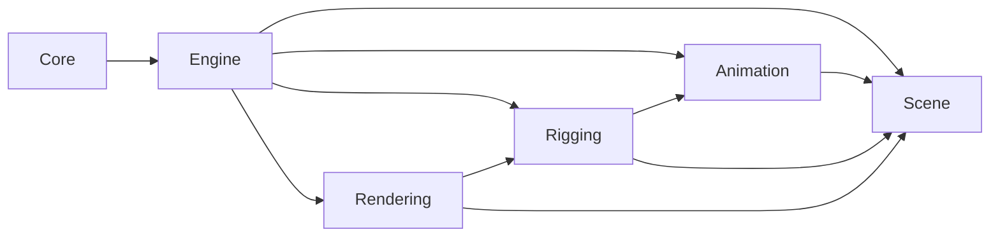

# Module Dependency Diagram

## Purpose

Tai lieu nay mo ta quan he phu thuoc giua 6 `module` kien truc cua `Project Phoenix` theo code hien tai vao ngay `2026-07-22`.

Muc tieu:

* thay duoc huong phu thuoc chinh
* biet cho nao la dependency truc tiep
* biet cho nao la dependency gian tiep qua orchestration
* dung lam neo cho refactor sau nay

---

## Module Graph

---

## How To Read This Graph

Quy uoc:

* mui ten `A -> B` = `A` phu thuoc vao `B`
* day la dependency theo code hien tai, khong phai dependency ly tuong 100%

Loai dependency:

* `hard dependency` = dependency cot loi, kho bo neu khong doi model kien truc
* `workflow dependency` = dependency do orchestration va user flow hien tai tao ra
* `incidental dependency` = dependency do placement code hien tai, co the giam dang ke khi refactor

Y nghia tong quat:

* `Core` dang dieu phoi gan nhu toan bo editor
* `Engine` chua tach thanh package rieng, nhung dang nam giua workflow runtime
* `Scene` la canonical data home
* `Animation` va `Rigging` dang mo rong tren `Scene`
* `Rendering` doc scene/evaluated state de ve viewport

---

## Module-By-Module Dependencies

### 1. Core

Phu thuoc truc tiep vao:

* `Engine`
* `Scene`
* `Animation`
* `Rigging`
* `Rendering`

Vi sao:

* `EditorShell` dang wire menu, toolbar, docks, playback, script, timeline, viewport
* `ScriptCommandSystem` route command vao cac thao tac scene/animation/rigging

Code neo:

* [src/core/app/EditorShell.h](</E:/Animation Software/src/core/app/EditorShell.h>)
* [src/core/app/EditorShell.cpp](</E:/Animation Software/src/core/app/EditorShell.cpp>)
* [src/core/commands/ScriptCommandSystem.h](</E:/Animation Software/src/core/commands/ScriptCommandSystem.h>)
* [src/core/commands/ScriptCommandSystem.cpp](</E:/Animation Software/src/core/commands/ScriptCommandSystem.cpp>)

### 2. Engine

Phu thuoc truc tiep vao:

* `Scene`
* `Animation`
* `Rigging`
* `Rendering`

Vi sao:

* playback tick va frame update can dong bo scene state, animation state, rigging evaluation, va viewport refresh

Code neo:

* [src/core/app/EditorShell.cpp](</E:/Animation Software/src/core/app/EditorShell.cpp>)
* [apps/editor/src/ViewportWidget.cpp](</E:/Animation Software/apps/editor/src/ViewportWidget.cpp>)
* [src/scene/Scene.cpp](</E:/Animation Software/src/scene/Scene.cpp>)

### 3. Scene

Phu thuoc truc tiep vao:

* khong co `module` domain nao thap hon trong stack nay

Vi sao:

* `Scene` dang la source of truth cho object, hierarchy, transform, bounds, visibility
* `Scene` van giu bridge API cho `Animation` va `Rigging`, nhung state va implementation ownership da duoc tach ra

Code neo:

* [src/scene/Scene.h](</E:/Animation Software/src/scene/Scene.h>)
* [src/scene/SceneObject.h](</E:/Animation Software/src/scene/SceneObject.h>)

### 4. Animation

Phu thuoc truc tiep vao:

* `Scene`

Vi sao:

* keyframe facade van di qua `SceneObject` va `Scene`
* nhung state va evaluation da song trong `ObjectAnimationState` va `SceneAnimationState`

Code neo:

* [src/animation/data/TransformKeyframeTrack.h](</E:/Animation Software/src/animation/data/TransformKeyframeTrack.h>)
* [src/animation/data/ObjectAnimationState.h](</E:/Animation Software/src/animation/data/ObjectAnimationState.h>)
* [src/animation/scene/SceneAnimationState.h](</E:/Animation Software/src/animation/scene/SceneAnimationState.h>)
* [src/scene/SceneObject.h](</E:/Animation Software/src/scene/SceneObject.h>)
* [src/scene/Scene.h](</E:/Animation Software/src/scene/Scene.h>)

### 5. Rigging

Phu thuoc truc tiep vao:

* `Scene`
* `Animation`

Vi sao:

* facade `Joint`, `Skeleton Hierarchy`, `Joint Orientation`, `Bind Pose`, skin bind state van di qua `SceneObject` va `Scene`
* nhung state/implementation da song trong `ObjectRigState` va `SceneRiggingController`

Code neo:

* [src/rigging/data/ObjectRigState.h](</E:/Animation Software/src/rigging/data/ObjectRigState.h>)
* [src/rigging/scene/SceneRiggingController.h](</E:/Animation Software/src/rigging/scene/SceneRiggingController.h>)
* [src/scene/SceneObject.h](</E:/Animation Software/src/scene/SceneObject.h>)
* [src/scene/Scene.h](</E:/Animation Software/src/scene/Scene.h>)

### 6. Rendering

Phu thuoc truc tiep vao:

* `Scene`
* `Rigging`

Vi sao:

* viewport draw doc mesh, bounds, transform, visibility tu `Scene`
* skeleton visualization va deformation support can state rigging

Code neo:

* [src/rendering/ViewportRenderer.h](</E:/Animation Software/src/rendering/ViewportRenderer.h>)
* [apps/editor/include/ViewportWidget.h](</E:/Animation Software/apps/editor/include/ViewportWidget.h>)
* [src/viewport/EditorCamera.h](</E:/Animation Software/src/viewport/EditorCamera.h>)

---

## Dependency Evidence Map

Phan nay map tung canh dependency sang `#include`, field/member type, hoac call site chinh trong code hien tai.

### `Core -> Engine` : `workflow dependency`

Bang chung chinh:

* [src/core/app/EditorShell.h](</E:/Animation Software/src/core/app/EditorShell.h:142>) khai bao `advancePlayback()`
* [src/core/app/EditorShell.h](</E:/Animation Software/src/core/app/EditorShell.h:185>) giu `QTimer* playbackTimer_`
* [src/core/app/EditorShell.cpp](</E:/Animation Software/src/core/app/EditorShell.cpp:179>) tao `QTimer`
* [src/core/app/EditorShell.cpp](</E:/Animation Software/src/core/app/EditorShell.cpp:181>) connect timer vao `EditorShell::advancePlayback`
* [src/core/app/EditorShell.cpp](</E:/Animation Software/src/core/app/EditorShell.cpp:3065>) implement `advancePlayback()`

Y nghia:

* `Core` dang tu giu playback/update orchestration thay vi chi phat lenh cho `Engine`
* dependency nay hop ly o muc workflow, nhung co the giam khi `Engine` duoc tach ro hon

### `Core -> Scene` : `incidental dependency`

Bang chung chinh:

* [src/core/app/EditorShell.h](</E:/Animation Software/src/core/app/EditorShell.h:10>) include `scene/Scene.h`
* [src/core/app/EditorShell.h](</E:/Animation Software/src/core/app/EditorShell.h:63>) `EditorHistoryState` giu mot `Scene scene`
* [src/core/app/EditorShell.cpp](</E:/Animation Software/src/core/app/EditorShell.cpp:1152>) save qua `PhoenixSceneDocument::saveToFile(viewport_->scene(), ...)`
* [src/core/app/EditorShell.cpp](</E:/Animation Software/src/core/app/EditorShell.cpp:2293>) copy `viewport_->scene()` vao history state
* [src/core/app/EditorShell.cpp](</E:/Animation Software/src/core/app/EditorShell.cpp:3074>) export bang cach copy subtree tu `viewport_->scene()`

Y nghia:

* `Core` khong chi dieu phoi UI ma dang doc/ghi truc tiep canonical scene state
* day la dependency nen giam bot sau refactor, vi `Core` khong nen om scene details qua sau

### `Core -> Animation` : `workflow dependency`

Bang chung chinh:

* [src/core/app/EditorShell.h](</E:/Animation Software/src/core/app/EditorShell.h:132>) khai bao `setCurrentFrame(...)`
* [src/core/app/EditorShell.h](</E:/Animation Software/src/core/app/EditorShell.h:133>) khai bao `setKeyForSelection(...)`
* [src/core/app/EditorShell.h](</E:/Animation Software/src/core/app/EditorShell.h:135>) khai bao `duplicateCurrentKeyForSelection(...)`
* [src/core/app/EditorShell.h](</E:/Animation Software/src/core/app/EditorShell.h:136>) khai bao `shiftSelectedObjectKeyframes(...)`
* [src/core/app/EditorShell.cpp](</E:/Animation Software/src/core/app/EditorShell.cpp:2744>) implement `setCurrentFrame(...)`
* [src/core/app/EditorShell.cpp](</E:/Animation Software/src/core/app/EditorShell.cpp:2777>) implement `setKeyForSelection(...)`
* [src/core/app/EditorShell.cpp](</E:/Animation Software/src/core/app/EditorShell.cpp:2853>) implement `duplicateCurrentKeyForSelection(...)`
* [src/core/app/EditorShell.cpp](</E:/Animation Software/src/core/app/EditorShell.cpp:2905>) implement `shiftSelectedObjectKeyframes(...)`
* [src/core/app/EditorShell.cpp](</E:/Animation Software/src/core/app/EditorShell.cpp:3003>) implement `jumpToSelectedObjectKeyframe(...)`

Y nghia:

* `Core` dang giu rat nhieu workflow policy cua `Animation`
* dependency nay co that o user flow hien tai, nhung nen duoc day dan vao `Engine` hoac seam authoring sau nay

### `Core -> Rigging` : `workflow dependency`

Bang chung chinh:

* [src/core/app/EditorShell.cpp](</E:/Animation Software/src/core/app/EditorShell.cpp:1423>) doc `meshObject` va `jointObject` tu scene de bind
* [src/core/app/EditorShell.cpp](</E:/Animation Software/src/core/app/EditorShell.cpp:1440>) tao `Scene updatedScene = viewport_->scene()`
* [src/core/app/EditorShell.cpp](</E:/Animation Software/src/core/app/EditorShell.cpp:1895>) goi `viewport_->setJointOrientation(...)`
* [src/core/app/EditorShell.cpp](</E:/Animation Software/src/core/app/EditorShell.cpp:3354>) apply `Joint Orientation` tu Channel Box

Y nghia:

* `Core` dang route va giu mot phan workflow policy cua `Rigging`
* dependency nay phan lon la do editor workflow, khong phai quan he domain bat buoc

### `Core -> Rendering` : `workflow dependency`

Bang chung chinh:

* [src/core/app/EditorShell.cpp](</E:/Animation Software/src/core/app/EditorShell.cpp:182>) dang ky callback tu viewport selection
* [src/core/app/EditorShell.cpp](</E:/Animation Software/src/core/app/EditorShell.cpp:466>) goi `viewport_->setWireframeEnabled(...)`
* [src/core/app/EditorShell.cpp](</E:/Animation Software/src/core/app/EditorShell.cpp:475>) goi `viewport_->setAxisVisible(...)`
* [src/core/app/EditorShell.cpp](</E:/Animation Software/src/core/app/EditorShell.cpp:483>) goi `viewport_->setBackfaceCullingEnabled(...)`
* [src/core/app/EditorShell.cpp](</E:/Animation Software/src/core/app/EditorShell.cpp:2681>) goi `viewport_->setCameraViewPreset(...)`

Y nghia:

* `Core` dang no ro `interface` viewport/rendering kha sau
* dependency nay chap nhan duoc, nhung muc do sau cua no hien tai van cao hon can thiet

### `Engine -> Scene` : `hard dependency`

Bang chung chinh:

* [apps/editor/src/ViewportWidget.cpp](</E:/Animation Software/apps/editor/src/ViewportWidget.cpp:374>) `ViewportWidget::setCurrentFrame(...)`
* [apps/editor/src/ViewportWidget.cpp](</E:/Animation Software/apps/editor/src/ViewportWidget.cpp:376>) goi `scene_.setCurrentFrame(frame)`
* [apps/editor/src/ViewportWidget.cpp](</E:/Animation Software/apps/editor/src/ViewportWidget.cpp:348>) goi `scene_.setLocalTransform(...)`
* [apps/editor/src/ViewportWidget.cpp](</E:/Animation Software/apps/editor/src/ViewportWidget.cpp:465>) goi `scene_.createObject(...)`
* [apps/editor/src/ViewportWidget.cpp](</E:/Animation Software/apps/editor/src/ViewportWidget.cpp:486>) goi `scene_.createJoint(...)`

Y nghia:

* phan orchestration runtime dang mutate `Scene` truc tiep
* day la dependency cot loi vi `Engine` can dieu phoi tren canonical data

### `Engine -> Animation` : `hard dependency`

Bang chung chinh:

* [src/core/app/EditorShell.cpp](</E:/Animation Software/src/core/app/EditorShell.cpp:3068>) playback tang frame qua `setCurrentFrame(nextFrame, false)`
* [apps/editor/src/ViewportWidget.cpp](</E:/Animation Software/apps/editor/src/ViewportWidget.cpp:381>) `ViewportWidget::setObjectKeyframe(...)`
* [apps/editor/src/ViewportWidget.cpp](</E:/Animation Software/apps/editor/src/ViewportWidget.cpp:384>) goi `scene_.setObjectKeyframe(...)`
* [apps/editor/src/ViewportWidget.cpp](</E:/Animation Software/apps/editor/src/ViewportWidget.cpp:393>) `ViewportWidget::removeObjectKeyframe(...)`
* [apps/editor/src/ViewportWidget.cpp](</E:/Animation Software/apps/editor/src/ViewportWidget.cpp:396>) goi `scene_.removeObjectKeyframe(...)`

Y nghia:

* runtime loop va authoring actions dang dung chung mot duong orchestration
* day la dependency cot loi cho playback va animation authoring runtime

### `Engine -> Rigging` : `hard dependency`

Bang chung chinh:

* [apps/editor/src/ViewportWidget.cpp](</E:/Animation Software/apps/editor/src/ViewportWidget.cpp:405>) `ViewportWidget::setJointOrientation(...)`
* [apps/editor/src/ViewportWidget.cpp](</E:/Animation Software/apps/editor/src/ViewportWidget.cpp:408>) goi `scene_.setJointOrientation(...)`
* [apps/editor/src/ViewportWidget.cpp](</E:/Animation Software/apps/editor/src/ViewportWidget.cpp:417>) `ViewportWidget::resetJointOrientation(...)`
* [apps/editor/src/ViewportWidget.cpp](</E:/Animation Software/apps/editor/src/ViewportWidget.cpp:441>) `ViewportWidget::captureBindPose(...)`
* [apps/editor/src/ViewportWidget.cpp](</E:/Animation Software/apps/editor/src/ViewportWidget.cpp:444>) goi `scene_.captureBindPose(...)`

Y nghia:

* phan runtime/editor bridge dang mutate `Rigging` state qua `Scene`
* day la dependency cot loi neu editor can evaluate skeleton, bind pose, va skinning trong runtime

### `Engine -> Rendering` : `workflow dependency`

Bang chung chinh:

* [apps/editor/src/ViewportWidget.cpp](</E:/Animation Software/apps/editor/src/ViewportWidget.cpp:298>) goi `syncSceneToRenderer()`
* [apps/editor/src/ViewportWidget.cpp](</E:/Animation Software/apps/editor/src/ViewportWidget.cpp:526>) trong init goi `renderer_.syncScene(scene_)`
* [apps/editor/src/ViewportWidget.cpp](</E:/Animation Software/apps/editor/src/ViewportWidget.cpp:539>) goi `renderer_.resize(width, height)`
* [apps/editor/src/ViewportWidget.cpp](</E:/Animation Software/apps/editor/src/ViewportWidget.cpp:553>) goi `renderer_.render(camera_, renderOptions_)`
* [apps/editor/src/ViewportWidget.cpp](</E:/Animation Software/apps/editor/src/ViewportWidget.cpp:685>) `syncSceneToRenderer()` goi `renderer_.syncScene(scene_)`

Y nghia:

* `ViewportWidget` dang la noi ghep runtime orchestration voi render backend
* dependency nay la workflow/runtime dependency hop ly, nhung can duoc dong goi sach hon

### `Animation -> Scene` : `hard dependency`

Bang chung chinh:

* [src/animation/data/TransformKeyframeTrack.h](</E:/Animation Software/src/animation/data/TransformKeyframeTrack.h:12>) dinh nghia `TransformKeyframeTrack`
* [src/animation/data/ObjectAnimationState.h](</E:/Animation Software/src/animation/data/ObjectAnimationState.h:6>) giu object-level animation state
* [src/animation/scene/SceneAnimationState.h](</E:/Animation Software/src/animation/scene/SceneAnimationState.h:6>) giu scene-level frame/evaluation state
* [src/scene/SceneObject.h](</E:/Animation Software/src/scene/SceneObject.h:49>) van expose bridge `transformKeyframes()`
* [src/scene/Scene.h](</E:/Animation Software/src/scene/Scene.h:31>) van expose bridge `setObjectKeyframe(...)`

Y nghia:

* `Animation` van phu thuoc vao canonical `Scene`
* nhung package seam da ro hon, va dependency nay gio di qua bridge/facade thay vi implementation chen trong `Scene.cpp`

### `Rigging -> Scene` : `hard dependency`

Bang chung chinh:

* [src/rigging/data/ObjectRigState.h](</E:/Animation Software/src/rigging/data/ObjectRigState.h:8>) giu `SkinWeight` va rig object state
* [src/scene/SceneObject.h](</E:/Animation Software/src/scene/SceneObject.h:14>) `SceneObject::Kind` van co `Joint`
* [src/rigging/scene/SceneRiggingController.h](</E:/Animation Software/src/rigging/scene/SceneRiggingController.h:13>) giu rigging scene API ownership
* [src/scene/Scene.h](</E:/Animation Software/src/scene/Scene.h:40>) van expose bridge `setJointOrientation(...)`
* [src/scene/Scene.h](</E:/Animation Software/src/scene/Scene.h:43>) van expose bridge `captureBindPose(...)`

Y nghia:

* `Rigging` hien dang la mot mo rong truc tiep cua canonical `Scene`
* day la dependency cot loi trong model hien tai

### `Rigging -> Animation` : `hard dependency`

Bang chung chinh:

* [CONTEXT.md](</E:/Animation Software/CONTEXT.md>) khoa quan he `Animated Rotation` ap len tren `Joint Orientation`
* [src/scene/Scene.cpp](</E:/Animation Software/src/scene/Scene.cpp:228>) trong `setLocalTransform(...)`, animation/local transform tac dong len object state
* [src/scene/Scene.cpp](</E:/Animation Software/src/scene/Scene.cpp:959>) `rebuildWorldData()` la noi state rigging va animated transform cung duoc evaluate

Y nghia:

* trong code hien tai, rig state va animated transform khong song doc lap
* day la dependency cot loi theo domain da khoa trong `CONTEXT.md`

### `Rendering -> Scene` : `hard dependency`

Bang chung chinh:

* [src/rendering/ViewportRenderer.h](</E:/Animation Software/src/rendering/ViewportRenderer.h:41>) `syncScene(const Scene& scene)`
* [src/rendering/ViewportRenderer.cpp](</E:/Animation Software/src/rendering/ViewportRenderer.cpp:651>) doc `scene.findObject(objectId)`
* [src/rendering/ViewportRenderer.cpp](</E:/Animation Software/src/rendering/ViewportRenderer.cpp:658>) doc `scene.findMesh(meshHandle)`
* [src/rendering/ViewportRenderer.cpp](</E:/Animation Software/src/rendering/ViewportRenderer.cpp:671>) doc `scene.worldTransform(objectId)`

Y nghia:

* render backend doc canonical scene data truc tiep
* day la dependency cot loi cua viewport backend

### `Rendering -> Rigging` : `hard dependency`

Bang chung chinh:

* [src/rendering/ViewportRenderer.cpp](</E:/Animation Software/src/rendering/ViewportRenderer.cpp:664>) dung `object->hasSkinBinding()` va `scene.buildDeformedMesh(...)`
* [src/rendering/ViewportRenderer.cpp](</E:/Animation Software/src/rendering/ViewportRenderer.cpp:727>) `uploadJointGeometry(const Scene& scene)`
* [src/rendering/ViewportRenderer.cpp](</E:/Animation Software/src/rendering/ViewportRenderer.cpp:738>) loc `object->isJoint()`
* [src/rendering/ViewportRenderer.cpp](</E:/Animation Software/src/rendering/ViewportRenderer.cpp:746>) duyet `childIds()` de ve skeleton lines

Y nghia:

* `Rendering` khong chi ve mesh chung, ma dang biet ro joint/skeleton/skinning state
* day la dependency cot loi mien la viewport con can skeleton draw va skin deformation

---

## Edge Classification Summary

### Hard dependencies

* `Engine -> Scene`
* `Engine -> Animation`
* `Engine -> Rigging`
* `Animation -> Scene`
* `Rigging -> Scene`
* `Rigging -> Animation`
* `Rendering -> Scene`
* `Rendering -> Rigging`

### Workflow dependencies

* `Core -> Engine`
* `Core -> Animation`
* `Core -> Rigging`
* `Core -> Rendering`
* `Engine -> Rendering`

### Incidental dependencies

* `Core -> Scene`

Ghi chu:

* `Core -> Scene` la canh nen nghi giam som nhat
* nhom `Core -> Animation/Rigging/Rendering` co the van ton tai, nhung nen nong hon va it biet chi tiet hon
* nhom `hard dependency` la xương sống cua product model hien tai, khong nen co gang cat bo bang moi gia

---

## Practical Interpretation

Neu doc theo muc do on dinh cua seam:

* `Scene` la diem trung tam on dinh nhat
* `Rendering` kha ro seam
* `Animation` va `Rigging` ro ve hanh vi nhung chua ro ve package
* `Engine` la `module` mo nhat
* `Core` dang giam qua nhieu orchestration vao `EditorShell`

---

## Desired Direction After Refactor

Huong refactor mong muon ve lau dai:

Khac biet chinh so voi hien tai:

* `Core` nen giam dependency truc tiep vao domain details
* `Engine` nen tro thanh noi dieu phoi chinh
* `Animation` va `Rigging` da co seam ro hon khoi `src/scene`

---

## Recommended Next Refactor Order

1. quyet dinh co cat tiep bridge API `Animation` khoi `Scene`/`SceneObject` hay giu de on dinh
2. quyet dinh co cat tiep bridge API `Rigging` khoi `Scene`/`SceneObject` hay giu de on dinh
3. rut playback/update orchestration khoi `EditorShell` thanh `Engine`
4. sau do moi giam tiep dependency truc tiep cua `Core`

---

## Edges To Cut First For `Engine` Extraction

Muc tieu cua section nay:

* khong co gang cat nhung `hard dependency`
* uu tien cat nhung canh lam `EditorShell` giu qua nhieu orchestration
* tao duong de dua playback, frame coordination, va authoring runtime vao `Engine`

### 1. Cat `Core -> Scene` truoc

Files:

* [src/core/app/EditorShell.h](</E:/Animation Software/src/core/app/EditorShell.h>)
* [src/core/app/EditorShell.cpp](</E:/Animation Software/src/core/app/EditorShell.cpp>)

Problem:

* `EditorShell` dang doc/ghi `Scene` truc tiep qua history, save/export helpers, va scene copying
* day la `module` quan sat thay ro nhat theo `deletion test`: xoa khoi `EditorShell` thi complexity khong mat, no chi chuyen ve mot noi dieu phoi dung hon

Solution:

* dua scene snapshot va scene mutation orchestration vao `Engine`
* de `EditorShell` chi gui intent nhu `save current document`, `capture undo state`, `export selection`

Benefits:

* tang `locality` cho scene lifecycle
* giam `interface` ma `Core` phai biet ve canonical data
* test scene workflow se bot phu thuoc vao full UI window

Vi sao uu tien so 1:

* day la canh `incidental dependency`
* cat no som nhat se lam `EditorShell` nhe hon ma it dung vao domain model cot loi

### 2. Cat phan playback/time cua `Core -> Animation`

Files:

* [src/core/app/EditorShell.h](</E:/Animation Software/src/core/app/EditorShell.h>)
* [src/core/app/EditorShell.cpp](</E:/Animation Software/src/core/app/EditorShell.cpp>)

Problem:

* `EditorShell` dang giu `playbackTimer_`, `advancePlayback()`, `setCurrentFrame()`, playback range, va jump logic
* day la hanh vi `Engine` ro rang nhat nhung dang nam trong `Core`

Solution:

* dua playback clock, frame stepping, playback range clamp, va current-frame orchestration vao `Engine`
* `EditorShell` chi con bind button/slider vao `Engine` interface

Benefits:

* tang `leverage` vi moi playback rule chi nam o mot noi
* tang `locality` cho bug lien quan frame update
* test playback khong can dung full `EditorShell`

Vi sao uu tien so 2:

* day la canh workflow quan trong nhat de `Engine` bat dau co hinh dang that su
* neu khong cat canh nay, `Engine` van se la khai niem mo ho

### 3. Cat nhom key-editing cua `Core -> Animation`

Files:

* [src/core/app/EditorShell.cpp](</E:/Animation Software/src/core/app/EditorShell.cpp>)
* [src/core/commands/ScriptCommandSystem.h](</E:/Animation Software/src/core/commands/ScriptCommandSystem.h>)
* [src/core/commands/ScriptCommandSystem.cpp](</E:/Animation Software/src/core/commands/ScriptCommandSystem.cpp>)

Problem:

* `EditorShell` dang giu workflow policy cho:
  * `set key`
  * `delete key`
  * `duplicate key`
  * `shift keyframes`
  * `jump to previous/next key`
* day la `Animation Authoring` logic, khong nen phan tan giua UI action handlers

Solution:

* tao mot seam authoring trong `Engine` hoac `Animation` module de gom nhom key ops
* UI va script commands deu di qua cung seam nay

Benefits:

* tang `locality` cho key editing rules
* tang `leverage` vi UI va script cung dung chung implementation
* test surface chuyen tu click-flow sang authoring seam ro hon

Vi sao uu tien so 3:

* no xay tren step playback/time
* sau khi frame coordination ra khoi `EditorShell`, nhom key ops se de gom hon

### 4. Cat nhom editor workflow cua `Core -> Rigging`

Files:

* [src/core/app/EditorShell.cpp](</E:/Animation Software/src/core/app/EditorShell.cpp>)
* [apps/editor/src/ViewportWidget.cpp](</E:/Animation Software/apps/editor/src/ViewportWidget.cpp>)

Problem:

* `EditorShell` dang giu policy cho:
  * `create joint`
  * `parent/unparent`
  * `bind skin`
  * `Joint Orientation`
  * `Bind Pose`
* day la workflow dependency, khong phai `Core` necessity

Solution:

* dua nhom rig authoring actions vao `Engine` orchestration hoac mot `Rigging` seam ro hon
* de `EditorShell` chi con la adapter cho menu, toolbar, inspector, va channel box

Benefits:

* tang `locality` cho rig authoring rules
* giam nguy co UI va script lech nhau
* de mo rong sau nay neu co them `Constraint` hoac `IK`

Vi sao uu tien so 4:

* no nen sau animation playback/key editing
* rigging hien da on cho beta, nen co the tach dan ma khong can dot pha ngay

### 5. Giu `Core -> Rendering` den cuoi va chi lam mong no

Files:

* [src/core/app/EditorShell.cpp](</E:/Animation Software/src/core/app/EditorShell.cpp>)
* [apps/editor/include/ViewportWidget.h](</E:/Animation Software/apps/editor/include/ViewportWidget.h>)
* [apps/editor/src/ViewportWidget.cpp](</E:/Animation Software/apps/editor/src/ViewportWidget.cpp>)

Problem:

* `EditorShell` dang biet kha nhieu ve viewport options va camera actions
* nhung day la workflow UI tu nhien hon so voi scene/animation/rigging mutation

Solution:

* khong uu tien cat bo hoan toan
* chi lam mong `interface` viewport de `EditorShell` goi it chi tiet hon

Benefits:

* tranh refactor qua rong cung luc
* bao toan UX viewport trong khi tap trung vao extraction cua `Engine`

Vi sao uu tien cuoi:

* canh nay khong phai nut that lon nhat cho `Engine`
* cat som qua de lam team mat nhip ma leverage thap hon

---

## Recommended Extraction Sequence

Neu toi uu cho risk thap va leverage cao, trinh tu nen la:

1. cat `Core -> Scene`
2. cat playback/time phan `Core -> Animation`
3. cat key-editing phan `Core -> Animation`
4. cat `Core -> Rigging`
5. lam mong `Core -> Rendering`

Noi ngan gon:

* cat nhung canh incidental truoc
* dua orchestration runtime vao `Engine` truoc
* giu render controls cho den khi `Engine` da co hinh dang ro

---

## Locked Extraction Order

Thu tu da chot cho pha nay la:

1. `Core -> Scene`
2. playback/time phan `Core -> Animation`
3. key-editing phan `Core -> Animation`
4. `Core -> Rigging`
5. `Core -> Rendering`

Tai lieu nay nen coi day la thu tu mac dinh khi lap ke hoach refactor `Engine` trong giai doan hien tai.
